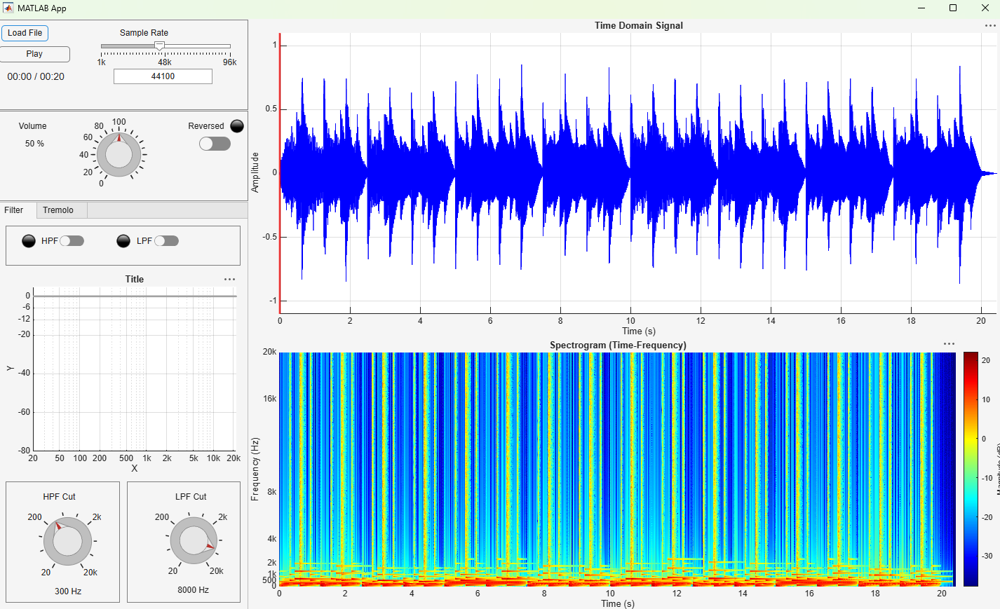
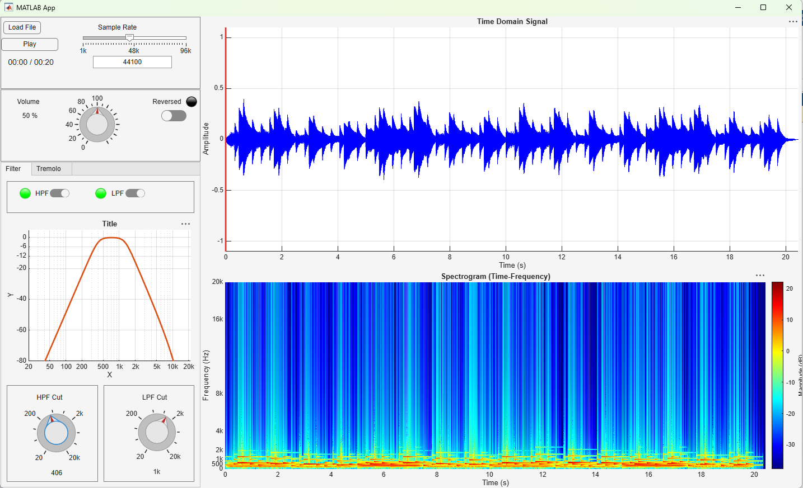
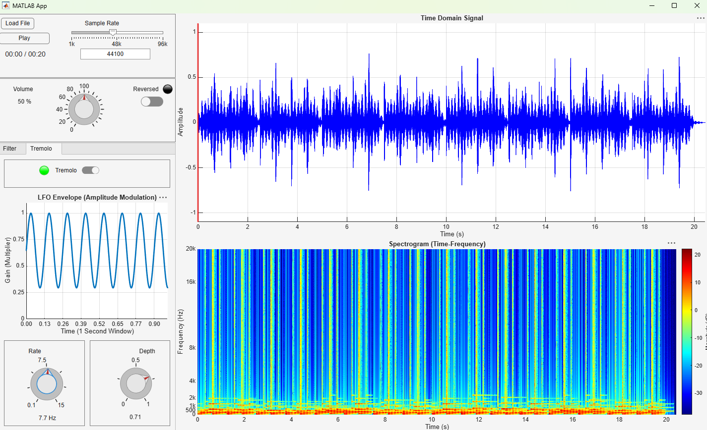

Interactive Audio Processing App
A MATLAB App Designer application for loading, playing, visualizing, and modifying audio. Developed as a two-person course project by Eliad Levy and Ron Rokach. Both collaborators worked together on the project; individual responsibilities are not attributed here.
Demo
Watch the 76-second demonstration · Download the original demo audio
The demo audio was synthesized specifically for this portfolio presentation. It was not part of the original course submission. The video and screenshots were recorded later using the submitted app.
Original audio	Filters enabled	Tremolo enabled
		
Features
Open WAV, MP3, and FLAC files; stereo input is combined into mono.
Play and pause audio, adjust volume, and reverse playback.
Enable fourth-order Butterworth high-pass and low-pass filters, set their cutoff frequencies, and view the combined magnitude response.
Apply tremolo and adjust its rate and depth while viewing the modulation envelope.
Inspect the processed waveform and spectrogram. A cursor follows playback in the waveform plot.
Adjust the playback sample-rate setting; see the limitations below.
Requirements
MATLAB with App Designer. The submitted `.mlapp` contains metadata from R2025b Update 4. The app was also run by one of its authors on R2026b; other releases have not been checked here.
Signal Processing Toolbox for `butter`, `freqz`, and `spectrogram`.
Audio Toolbox or DSP System Toolbox providing `audioDeviceWriter`, plus a working audio output device.
Simulink for this unmodified file: It contains an unused property declared as `simulink.Simulation`. Simulink is not used to process audio, but the property declaration can prevent the original app from opening when Simulink is absent.
Run the app
Download `audioPlayer.mlapp` and open it in MATLAB App Designer.
Click Run in App Designer.
Click Load File and choose a WAV, MP3, or FLAC file. You can use `media/demo-audio.wav`.
Click Play. Use the Filter and Tremolo tabs to adjust the effects; use Reversed to reverse playback. The waveform and spectrogram update as settings change.
No separate build step is needed. The filename `audioPlayer.mlapp` matches the app's internal class name; only the supplied file's name was changed from `audioPlayer(2).mlapp`, and its contents were preserved.
Implementation notes and limitations
The app processes a loaded file in memory for visualization and processes audio in chunks during playback. Performance for long files has not been measured.
Changing the sample-rate setting changes the rate used for playback and plots; it does not perform pitch-preserving resampling. Supported playback rates depend on the computer's audio device.
Stereo files are downmixed to mono on load.
The filter response graph retains generic title and axis placeholders in the submitted interface. This is a cosmetic issue in the original app.
Automated tests and cross-platform compatibility have not been verified. The video documents the app running on an author's computer; it does not establish compatibility with every MATLAB installation or audio device.
Project credit
Course project by Eliad Levy and Ron Rokach. The supplied `.mlapp` is the submitted project file; the synthetic sample, screenshots, video, and this documentation were prepared afterward for the portfolio.
No license has been selected for this shared project. Public availability does not grant permission to reuse its code; contact the authors before reuse.
